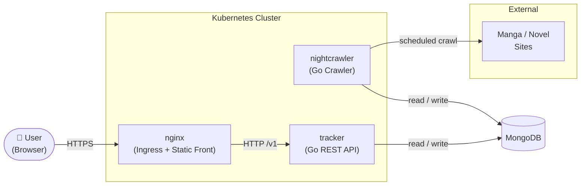
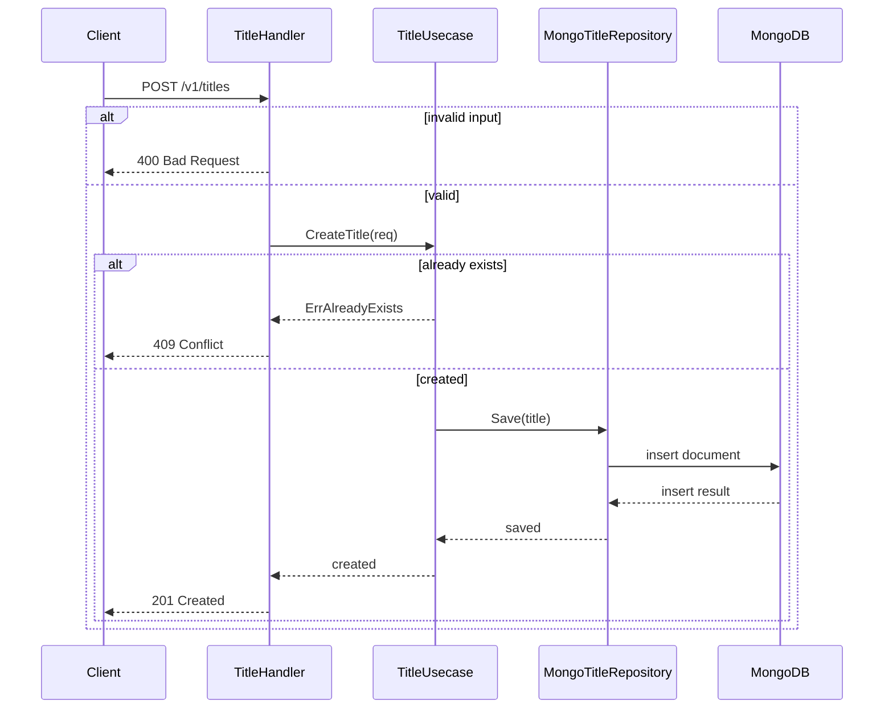
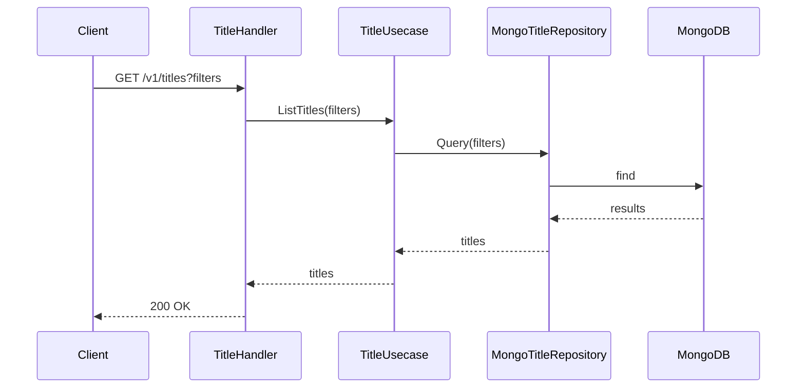
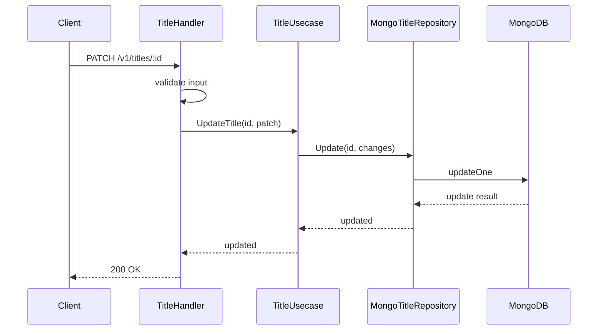
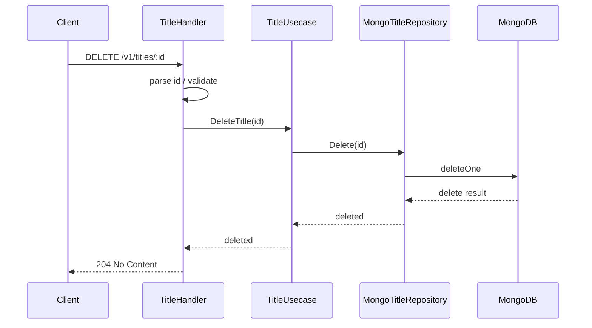
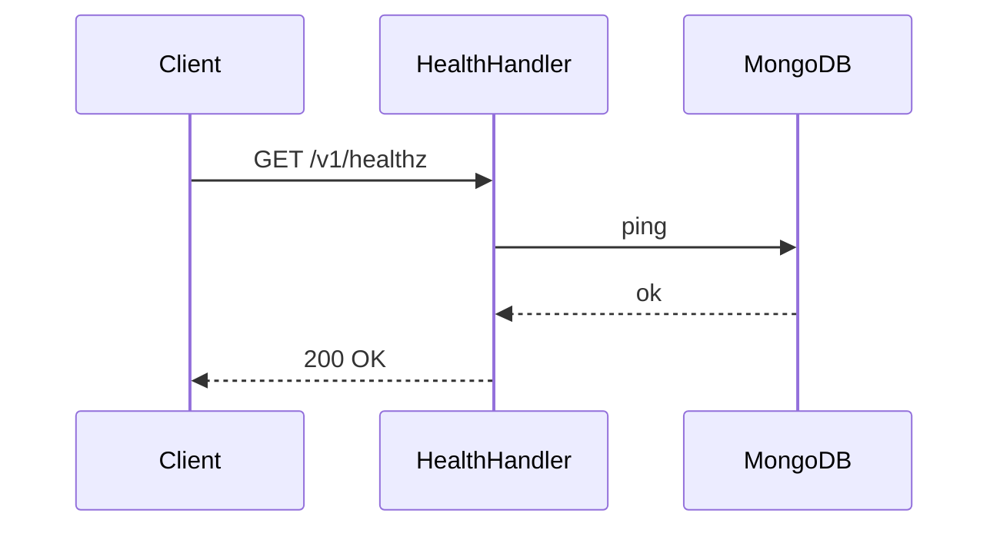
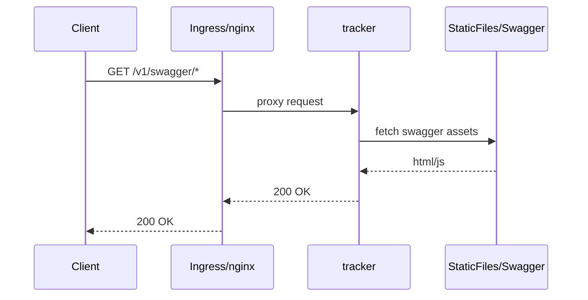
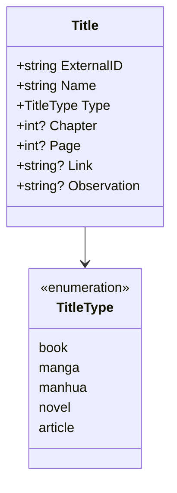

# Architecture

A high-level overview of the **read-tracker** system: its components, how they communicate, and how they are deployed.

---

## System Topology

The macro view — from user to storage.

---

## Workloads

| Workload | Path | Role |
|---|---|---|
| **tracker** | `tracker/` | REST API — persists and retrieves reading progress |
| **nightcrawler** | `nightcrawler/` | Crawler — fetches newly released chapters from external sites |
| **front** | `front/` | Browser UI — built into static files and served directly by nginx *(coming soon)* |

---

## Public API Endpoints

Base path: `/v1`

| Method | Path | Description | Handler |
|---|---|---|---|
| `GET` | `/titles` | List titles (filter by `type`, `name`) | `tracker/handler/title.go:ListTitles` |
| `POST` | `/titles` | Create a new title | `tracker/handler/title.go:CreateTitle` |
| `PATCH` | `/titles/:id` | Partial update (chapter, page, link, observation) | `tracker/handler/title.go:UpdateTitle` |
| `DELETE` | `/titles/:id` | Delete a title | `tracker/handler/title.go:DeleteTitle` |
| `GET` | `/healthz` | Health check (liveness probe) | `tracker/cmd/api/main.go` (inline) |
| `GET` | `/swagger/*` | Swagger UI | `tracker/cmd/api/main.go` (gin-swagger) |

---

## tracker — Internal Architecture

The API follows **Clean Architecture**: each layer depends only on the layer below it via interfaces, and the domain has no outward dependencies.

The following sequence diagrams show the request flow for each API router: handler validation, usecase invocation, repository persistence, and DB interaction.

(Health and swagger endpoints are simple probes and do not modify domain state.)

### Domain Model

---

